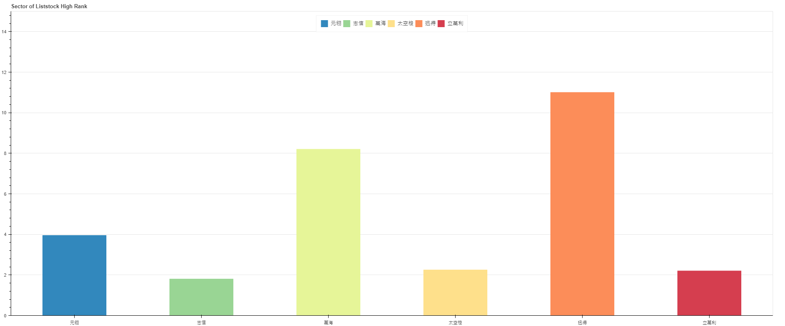
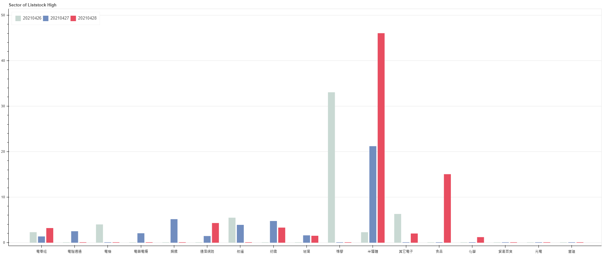
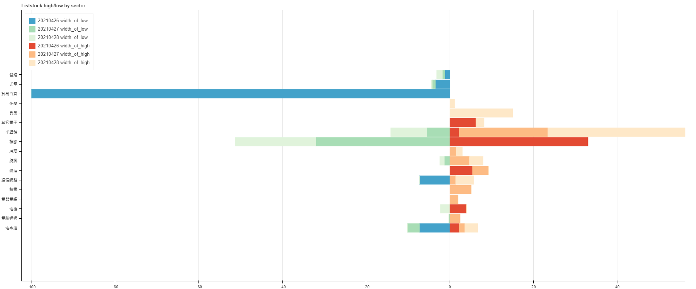
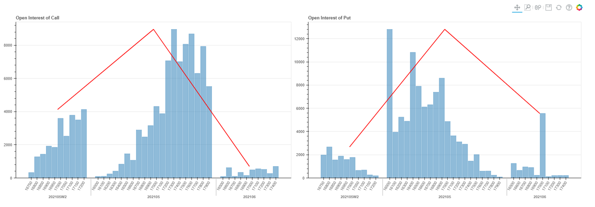

Trade_data
---
This is a rough analysis about data from different financial products maily in Taiwan area. Observing trends by plotting graphs so that to avoid making unnecessary
errors and help make investment decesion .   

### Bargaining chip researched ###
---
Bargaining chip distribution means that captial flows direction, it is very likely to reveal market direction.

* **rough analysis**

  + Use python packages to crawl data from TAIFEX or WANTGOO page. 
  + Stored the frequently-updated data into database.
  + Connected to database to grab and arrange data.
  + Used Bokeh to generate different categories of figures.

### Tools ###
---
* Datacrawl:Python
* Database:MySQL
* Plot:Bokeh

### Images description ###
---
**1.Liststock high rank**

 + Info about liststock which dominate the day of high. 
 

---

**2.Liststock high by sector**

 + Info about liststock which dominate high by diffrent sector in a period of time. 

---

**3. Liststock high and low by sector**

 + Info about liststock which  dominate high or low by different sector in a period of time.

---

**4. Open interest of option**

 + Info about open interest of option call/put of different expire date.
 

### Contact ###
---
E-mail:awestlifeblue@gmail.com

